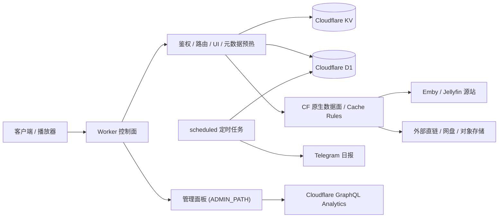
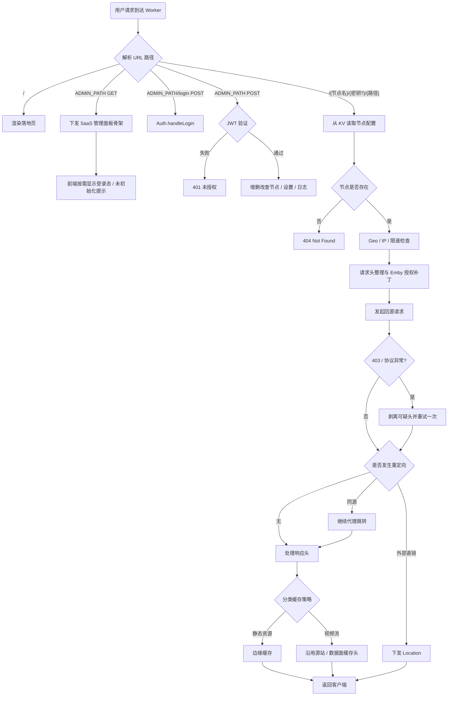

 # CF-EMBY-PROXY-UI

<p align="center">
  <strong>基于 Cloudflare Workers 的 Emby/Jellyfin 代理、分流与可视化管理面板</strong>
</p>

<p align="center">
  
  
  
  
</p>

> 一个单文件 `worker.js` 项目：统一多台 Emby 节点入口、隐藏源站 IP、支持直连/反代混合策略、提供 `ADMIN_PATH`（默认 `/admin`）可视化后台，并集成日志、Cloudflare 统计、Telegram 日报与控制面 / 数据面分层优化。

> 当前版本的全局设置页已支持新手 / 高手模式切换、设置变更快照、全局设置专用迁移，以及“系统 UI / 代理与网络 / 静态资源策略 / 安全防护 / 日志设置 / 监控告警 / 账号设置 / 备份与恢复”分区导航；同时继续保留控制面 / 数据面分层、缓存键清洗、转码 `m3u8` 禁缓存、Geo 白/黑名单模式切换等优化。

  


 - 讨论群：https://t.me/+NhDf7qMxH4ZlODY9
 - 教程文档：https://wiki.8081666.xyz
 - 这是一个面向个人的Worker 代理方案，对于家庭来说免费版worker请求数可能不够用
 - 建议每次新增多个节点后导出 JSON 做本地备份
 - ⚠️提示：本工具仅供学习，请遵守当地法律法规，造成的一切后果自负。

## 目录

- [项目简介](#项目简介)
- [核心能力](#核心能力)
- [架构总览](#架构总览)
- [功能矩阵](#功能矩阵)
- [工作原理](#工作原理)
- [部署前须知](#部署前须知)
- [环境变量与绑定](#环境变量与绑定)
- [部署步骤](#部署步骤)
- [自定义域绑定与优选域名路由教程](#自定义域绑定与优选域名路由教程)
- [文档导航](#文档导航)
- [后台功能说明](#后台功能说明)
- [节点访问方式](#节点访问方式)
- [缓存与性能设计](#缓存与性能设计)
- [安全机制](#安全机制)
- [数据存储说明](#数据存储说明)
- [请求处理流程图](#请求处理流程图)
- [致谢](#致谢)
- [常见问题](#常见问题)

---

## 项目简介

**CF-EMBY-PROXY-UI** 是一个运行在 **Cloudflare Workers** 上的媒体代理系统，适用于：

- 多台 Emby / Jellyfin 服务器统一入口
- 隐藏源站真实 IP
- 为海外源站提供 Cloudflare 边缘加速
- 提供带 UI 的管理后台，而不是纯手改配置
- 实现“反代 + 直连”混合路由

项目当前版本在单文件内集成了以下模块：认证、KV/D1 数据管理、代理主链路、日志、可视化控制台、定时任务入口。代码头部也明确将其定义为单文件部署架构。 

---

## 核心能力

### 1) 可视化管理
- 后台地址：`ADMIN_PATH`（默认 `/admin`）
- 支持节点新增、编辑、删除、导入、导出
- 支持全局 Ping / 健康检查
- 支持仪表盘展示请求量、运行状态、流量趋势、资源分类徽章
- 支持 DNS 编辑双模式：`CNAME模式` / `A模式` 可切换，保存时自动处理互斥关系
- 支持推荐优选域名卡片、DNS 历史卡片回填，以及 DNS 实用链接快捷跳转
- 支持全局设置新手 / 高手模式切换，默认新手模式隐藏高风险高级项
- 支持冷启动初始化自检，缺少 `JWT_SECRET` / `ADMIN_PASS` 时直接在控制台与页面提示
- 支持“一键整理 KV 数据”，用于修复旧版本升级后 `sys:theme` 脏值、`sys:nodes_index` 错乱与遗留缓存键
- 支持设置变更快照、全局设置专用迁移与完整备份

### 2) 智能代理与分流
- 默认由 Worker 透明中继请求与响应
- 支持同源 30x 继续代理
- 支持显式“源站直连节点”名单
- 支持外链强制反代或直接下发 `Location`
- 内置 `wangpandirect` 关键词匹配，可识别网盘 / 对象存储链接并直连

### 3) 媒体场景优化
- 静态资源、封面、字幕与视频流分开处理
- 大视频流不在 Worker 内做对象缓存，响应缓存头尽量沿用源站 / Cloudflare 数据面策略
- 支持轻量级元数据预热（海报 / 白名单 `.m3u8` / 字幕），不在 Worker 内做视频 Range 旁路预取或大对象缓存
- 轻量级元数据预热自带快速熔断，源站 3 秒内无响应就直接放弃预热
- Worker 元数据缓存键会自动清洗 Token、设备号、播放会话等噪声参数，提升跨用户命中率
- 转码 `m3u8` 与非白名单播放列表不会写入 Worker 缓存
- 视频主字节流尽量交给 Cloudflare 原生网关、Range 断点续传与 Cache Rules 处理
- 支持 WebSocket 透明转发
- 支持 Emby / Jellyfin 媒体授权头兼容与安全同步，并可按节点显式指定上游类型
- 支持节点级真实客户端 IP 透传控制，便于兼容按来源 IP 风控的特殊上游

### 4) 安全与可观测性
- 登录失败次数限制，达到阈值自动锁定 15 分钟
- 支持自定义管理路径 `ADMIN_PATH`，降低固定 `/admin` 扫描命中率
- 国家/地区白名单 / 黑名单模式切换
- IP 黑名单
- 单 IP 请求限速（按分钟）
- 日志写入 D1、运行状态优先写入 D1 `sys_status`（KV 兜底）、定时清理、Telegram 每日报表
- DNS 修改属于敏感操作，管理 API 需要显式确认头；当前 UI 主链路按“站点级草稿 -> 保存时统一同步”执行
- 支持 Cloudflare GraphQL 仪表盘统计与本地 D1 兜底统计

---

## 架构总览



---

## 功能矩阵

| 模块 | 说明 |
|---|---|
| 后台认证 | JWT 登录态，密码错误累计锁定 |
| 节点管理 | 节点增删改查、导入导出、备注/标签/密钥 |
| 路由模式 | 透明反代、同源跳转继续代理、源站直连节点 |
| 外链策略 | 强制反代外部链接 / 直接下发 Location |
| 网盘直连 | `wangpandirect` 关键词模糊匹配 |
| 缓存 | 静态资源缓存、视频透传、字幕边缘缓存、预热微缓存 |
| 安全 | Geo 白名单/黑名单模式、IP 黑名单、单 IP 限速、真实客户端 IP 透传模式 |
| 兼容补丁 | `Authorization` / `X-Emby-Authorization` / `X-MediaBrowser-Authorization` 兼容 |
| 协议优化 | H1/H2/H3 开关、晚高峰自动降级、403 重试 |
| 日志监控 | D1 请求日志、清理任务、Telegram 日报 |
| 仪表盘 | Cloudflare GraphQL 聚合 + D1 本地兜底 |
| 设置中心 | 新手/高手模式、分区导航、设置快照、专用迁移 |
| 连接能力 | HTTP(S) + WebSocket |

---

## 工作原理

### 请求转发原理
客户端请求先到 Worker，Worker 根据 URL 中的节点名读取 KV 中的节点配置，再构造回源请求发送到 Emby 源站；源站响应由 Worker 流式回传给客户端。对普通 API、静态资源、视频流、重定向、WebSocket，会分别走不同的处理分支。

### IP 隐藏原理
Worker 作为公网入口，外部只能看到 Cloudflare 边缘节点，而不是你的 Emby 源站真实 IP。需要注意的是，这种“隐藏”是网络入口层面的隐藏，不等于完全匿名：Cloudflare 仍会追加自身请求头，源站 TCP 层看到的也仍然是 Cloudflare 网络。

默认情况下，项目在回源时会先清洗 `X-Real-IP` / `X-Forwarded-For` / `Forwarded` 以及 `Connection` / `Upgrade` 等易伪造或可能影响协议升级的请求头，再由 Worker 注入真实内容，方便上游日志审计与访问控制。

这里的“真实 IP”指的是客户端与 Cloudflare 建立连接时被 Cloudflare 识别到的来源 IP。它可以是用户本机的公网出口 IP，也可以是用户前置代理的出口 IP。默认情况下，节点会透传 `X-Real-IP` 和 `X-Forwarded-For`；项目注入的这两个请求头传达的是同一个真实 IP，其中 `X-Forwarded-For` 不是完整代理链。并且注入发生在节点自定义请求头之后，因此节点里新增同名请求头也不能覆盖这两个值。如果个别上游会按真实出口 IP、地区或 ASN 做风控，也可以在节点级改为仅保留 `X-Real-IP`、强制不透传【慎用】。

### 直连 / 反代混合原理
本项目不是“全量一刀切反代”。它支持：

- 节点默认走 Worker 中继
- 同源 30x 跳转继续代理
- 某些节点被显式标记为“源站直连节点”后，源站 2xx 可直接下发给客户端
- 命中网盘关键词或外链策略时，可直接把目标地址返回给客户端

这意味着它既能保留 Worker 统一入口，也能在带宽敏感场景下降低 Worker 中继成本。

### 控制面 / 数据面分离原理
这次架构调整的核心，是让 Worker 只做自己擅长的轻逻辑：

- **控制面（Worker）**：鉴权、路由、UI 渲染、元数据处理、轻量级预热、轻量缓存键清洗
- **数据面（Cloudflare 原生网关）**：视频主字节流、Range 断点续传、边缘缓存、Cache Rules 脱敏共享

对应到实现上，项目已经移除了 Worker 里对视频流的“黑洞式 drain”和大对象缓存倾向。海报、字幕、白名单播放列表继续在 Worker 层用 `caches.default` 做轻缓存；而视频本体则尽量保持薄透传，更依赖 Cloudflare 底层转发与 Cache Rules 配置，尤其建议为视频路径启用 **Ignore query string** 来实现跨用户共享缓存。

---

## 部署前须知

### 适合什么场景
- Emby 源站在海外，直连线路差
- 多台服务器希望统一访问域名
- 不想暴露源站真实 IP
- 需要可视化后台维护节点

### 不太适合什么场景
- 局域网 / 内网直连环境
- 源站本身就在国内优质线路（如 CN2）
- 大规模公共分享、超大带宽分发

### 使用风险提醒
- 腐竹如果明确禁止 CF 反代，使用该方案可能导致账号受限
- Cloudflare 可能识别高流量滥用，建议仅用于个人或家庭分享
- Worker 并不能抹除所有 CF 痕迹，请求头和源 IP 识别仍有暴露反代特征的可能

---

## 环境变量与绑定


## ⚙️ 环境变量与绑定配置指南

在部署本项目时，你需要配置相应的环境变量与服务绑定。为了方便管理，我们将配置项分为 **Worker 核心配置**（在 Cloudflare 控制台设置）和 **SaaS 面板进阶配置**（在部署后的管理后台设置）。

### 一、 Worker 核心配置（控制台填写）

在 Cloudflare Worker 的 设置 -> 变量和机密 或 绑定页面 中进行配置。建议首次部署时对照下表直接填写：

#### [必需项]

这些是系统正常运行的基础，**必须配置**。

| 变量名 / 绑定名称 | 类型 | 作用说明 | 配置示例 / 建议 |
| :--- | :--- | :--- | :--- |
| **`ENI_KV`** | KV 绑定 | **核心数据存储**。用于持久化保存项目主配置、节点信息、失败计数统计以及登录锁定状态等。 | 绑定你创建的 KV 命名空间（例如：`EMBY_DATA`）。 |
| **`ADMIN_PASS`** | 加密变量 (Secret) | **后台登录密码**。用于验证管理面板的访问权限。 | `MyStrongPassword123` |
| **`JWT_SECRET`** | 加密变量 (Secret) | **安全会话密钥**。用于生成和校验后台登录状态 (JWT)，防止越权访问。 | 建议填入一段高强度的随机长字符串。 |

####  [可选项]

按需配置，用于开启日志统计或自定义系统行为。

| 变量名 / 绑定名称 | 类型 | 作用说明 | 配置示例 / 建议 |
| :--- | :--- | :--- | :--- |
| **`DB`** | D1 绑定 | **日志数据库**。绑定后可开启请求日志审计、流量统计及自动化日报功能。 | 绑定你创建的 D1 数据库。 |
| **`ADMIN_PATH`** | 文本变量 (Var) | **自定义管理入口**。用于修改默认的 `/admin` 路径，有效防范自动化扫描工具的嗅探。 | `/secret_portal_99`<br>\> ⚠️ **注意**：不能以 `/api` 开头。 |

> 💡 **命名兼容性提示**：
> 核心代码已向下兼容多种旧版命名（如 `KV` / `EMBY_KV` / `EMBY_PROXY` 会自动映射为 `ENI_KV`，`D1` / `PROXY_LOGS` 会映射为 `DB`）。但**强烈建议在新部署时统一使用 `ENI_KV` 和 `DB`**，以确保与后续的更新、README 说明及自动化脚本保持一致。

-----

### 二、 SaaS 面板进阶配置（后台 UI 填写）

项目部署成功并登录管理后台后，可在\*\*“全局设置”\*\*中配置以下进阶参数。这些参数最终会安全地加密存储在 `ENI_KV` 中。

| 参数分类 | 参数名 | 作用说明 |
| :--: | :--- | :--- |
| **Cloudflare 联动***(推荐配置)* | **`cfApiToken`** | **Cloudflare API 令牌**：用于实现一键清理缓存、GraphQL 流量高级统计等深度联动功能。 |
| | **`cfZoneId`** | **区域 ID**：对应你当前代理域名所在的 Zone ID。 |
| | **`cfAccountId`** | **账户 ID**：对应你的 Cloudflare 账户 ID。 |
| **Telegram 通知***(按需配置)* | **`tgBotToken`** | **机器人 Token**：用于发送每日数据报表及系统告警。 |
| | **`tgChatId`** | **会话 ID**：接收通知的个人或群组 Chat ID。 |

> 💡 **节点级补充**：
> “媒体认证头模式”和“真实客户端 IP 透传”都支持在 **节点编辑面板** 单独配置。
> 适合按节点对个别 Emby / Jellyfin 源站或特殊风控上游做差异化处理。

-----

### 三、 Cloudflare API Token 权限建议

如果你希望在后台配置 `cfApiToken` 以启用完整的增强能力（如仪表盘高级统计、一键清缓存），请确保生成的 API Token 至少包含以下权限：

  * **Account (账户级)**
      * `Account Analytics` -\> **Read** (读取)
      * `Workers Scripts` -\> **Read** (读取)
  * **Zone (区域级)**
      * `Workers Routes` -\> **Read** (读取)
      * `Analytics` -\> **Read** (读取)
      * `Cache Purge` -\> **Purge** (清除)
      * `DNS` -\> **Edit** (编辑)
      * 
      
      
> **📝 提示**：如果你仅需要基础的代理分发与节点管理，不需要仪表盘数据增强或缓存控制，可以暂不配置此 Token。

-----

### 四、 定时触发器 (Cron Triggers)

为实现自动化运维，本项目依赖 Cloudflare Worker 的定时触发器功能。

  * **功能作用**：驱动定时清理过期日志、发送 Telegram 每日报表以及执行节点异常告警检查。
  * **配置方式**：请前往 Worker 控制台的 **Triggers (触发器)** 选项卡中手动添加。*(注：社区交流时常有人误拼成 `corn`，请确认拼写为 `cron`)*。
  * **生效时间**：根据 Cloudflare 官方说明，Cron 表达式基于 **UTC 时区** 运行。配置变更后，最多可能需要约 15 分钟才能传播到全球边缘节点生效。


---

## 部署步骤

### 第一步：创建 KV
1. 打开 Cloudflare Dashboard
2. 进入**左侧导航栏>储存与数据库 > Workers KV**
3. 创建一个 命名空间，例如：`EMBY_DATA`

### 第二步：创建 Worker
你可以任选以下三种方式：

#### 方式 A：Cloudflare 控制台直接粘贴
1. 进入 **Workers 和 Pages -> 创建应用 -> 从helloworld开始->设置名称创建**
2. 创建后进入 **Edit code**
3. 将 `worker.js` 全量替换进去并部署

#### 方式 B：通过 Cloudflare 连接 GitHub 自动部署
1. 先将当前项目Fork到你自己的 GitHub 仓库
2. 先打开仓库根目录的 `wrangler.toml`
3. 如果你希望修改 Worker 名称，先把 `name` 改成你要使用的名称
4. 点击**Cloudflare Dashboard**左侧导航栏的 **存储和数据库**
5. 获取 KV ID
   - 在下拉菜单或页面中选择 **KV**
   - 在列表中找到并点击你为项目创建的 KV 命名空间
   - 进入详情页后，在右侧面板找到并复制 **命名空间 ID (Namespace ID)** 对应`id`
6. 如果你准备启用 D1 日志功能，再获取 D1 名称和 ID
   - 同样在 **存储和数据库** 下，选择 **D1 SQL 数据库**
   - 如果还没有数据库，可以先按下方“第四步”创建一个，再回来继续
   - 点击你的数据库名称进入概览页面
   - 记下这里的数据库名称对应`database_name`，并复制页面上显示的 **数据库 ID (Database ID)**对应`database_id`
7. 将上面获取到的值填入仓库根目录 `wrangler.toml` 中的 `id`、`database_name` 和 `database_id`
8. 如果你暂时不使用 D1，请先删除 `wrangler.toml` 中的 `[[d1_databases]]` 配置段，再进行首次部署
9. 把修改后的 `wrangler.toml` 提交并推送到你自己的 GitHub 仓库
10. 在 Cloudflare 中进入 **Workers 和 Pages**，选择连接 GitHub 仓库创建 Worker
11. 选择本仓库后，保持仓库根目录为部署根目录，然后执行首次部署
12. Cloudflare 会读取仓库内的 `wrangler.toml`，并以 `worker.js` 作为入口文件
13. 首次部署完成后，后续只要你向已绑定分支 `push` 新提交，Cloudflare 就会自动拉取最新代码并重新部署

> 仓库中的 `wrangler.toml` 现在同时声明 Worker 入口、兼容日期以及 KV / D1 绑定信息；部署前请先把占位符替换成你自己的实际值。

完成方式 B 部署后，可以继续跳转到 **第五步：设置环境变量**。

#### 方式 C：通过 GitHub Actions 自动部署
1. 先将当前项目Fork到你自己的 GitHub 仓库
2. 打开仓库根目录的 `wrangler.toml`
3. 如果你希望修改 Worker 名称，先把 `name` 改成你要使用的名称
4. 点击**Cloudflare Dashboard**左侧导航栏的 **存储和数据库**
5. 获取 KV ID
   - 在下拉菜单或页面中选择 **KV**
   - 在列表中找到并点击你为项目创建的 KV 命名空间
   - 进入详情页后，在右侧面板找到并复制 **命名空间 ID (Namespace ID)**
6. 如果你准备启用 D1 日志功能，再获取 D1 名称和 ID
   - 同样在 **存储和数据库** 下，选择 **D1 SQL 数据库**
   - 如果还没有数据库，可以先按下方“第四步”创建一个，再回来继续
   - 点击你的数据库名称进入概览页面
   - 记下这里的数据库名称，并复制页面上显示的 **数据库 ID (Database ID)**
7. 将上面获取到的值填入仓库根目录 `wrangler.toml` 中的 `id`、`database_name` 和 `database_id`
8. 如果你暂时不使用 D1，请先删除 `wrangler.toml` 中的 `[[d1_databases]]` 配置段
9. 在 GitHub 仓库的 **Settings -> Secrets and variables -> Actions** 中新增以下 Secrets
   - `CLOUDFLARE_ACCOUNT_ID`：你的 Cloudflare Account ID
   - `CLOUDFLARE_API_TOKEN`：使用 **Edit Cloudflare Workers** 模板创建的 API Token
10. 将仓库中的 [deploy-worker.yml](./.github/workflows/deploy-worker.yml) 提交并推送到 `main` 或 `master` 分支
11. 对于当前这种纯 `worker.js` + `wrangler.toml` 结构，GitHub Actions 会直接调用 Wrangler 部署到 Cloudflare Workers
12. 如果你的默认部署分支不是 `main` 或 `master`，请先修改 `.github/workflows/deploy-worker.yml` 里的 `branches` 配置
13. 首次部署后，后续每次向已配置分支 `push` 新提交，GitHub Actions 都会自动重新部署

> 方式 C 不依赖 Cloudflare 的 Git 仓库集成，而是由 GitHub Actions 直接读取仓库根目录的 `worker.js` 和 `wrangler.toml` 完成部署；如果你更希望把部署权限收敛在 GitHub Secrets 中，这种方式会更合适。

完成方式 C 部署后，可以继续跳转到 **第五步：设置环境变量**。

### 第三步：绑定 KV（方式 A 必做）
1. 如果你使用的是方式 A，打开 Worker 的绑定页
2. 添加绑定选择KV 命名空间
3. 变量名填：`ENI_KV`
4. 绑定到你刚创建的 KV

### 第四步：创建并绑定 D1（可选但推荐）
1. 打开 左侧导航栏->储存与数据库 -> D1SQL数据库
2. 创建数据库，例如：`emby_proxy_logs`
3. 如果你使用的是方式 A，回到 Worker 绑定页，添加绑定选择D1 数据库
4. 变量名填：`DB`
5. 如果你使用的是方式 B 或方式 C，请把数据库名称和数据库 ID 填入 `wrangler.toml`，然后重新推送到已绑定分支触发自动部署
6. 后续在后台“日志记录”页面执行初始化 DB

> 如果你使用“方式 A：控制台直接粘贴”，KV / D1 仍然需要在 Cloudflare Dashboard 中手动绑定；如果你使用“方式 B / 方式 C”，则优先以 `wrangler.toml` 中填写的绑定信息为准。

### 第五步：设置环境变量
在 Worker 的 变量与机密 中新增：

- `ADMIN_PASS`：后台密码
- `JWT_SECRET`：随机高强度字符串
- `ADMIN_PATH`：可选，自定义管理后台入口，默认 `/admin`

> 如果首次请求时缺少 `ADMIN_PASS` 或 `JWT_SECRET`，Worker 会在控制台打印一次初始化警告，首页和管理页也会显示“系统未初始化”提示。

### 第六步：按需添加 Cron Trigger
如果你需要自动清理日志、发送 Telegram 日报或定时异常告警，再补这一步：

1. 打开 Worker 的 **Triggers**
2. 添加一个 **Cron Trigger**
3. 例如可先使用每天一次的表达式：`0 1 * * *`
4. 保存后等待 Cloudflare 全球传播生效

> Cloudflare 官方文档说明：注意Cron Trigger 使用 UTC，而中国时区是UTC+8,免费计划最多 5 个、付费计划最多 250 个；单次 Cron 执行最长 15 分钟。

### 第七步：自定义域绑定与优选域名路由教程 

Cloudflare Dashboard->左侧导航栏->域注册->管理域 

点击要绑定的域名，在仪表盘右侧DNS模块，点击DNS记录

#### 添加DNS记录 


类型选择CNAME ，名称自定义，目标为优选域名 可以从https://cf.090227.xyz/ 中选

优选域名推荐：saas.sin.fan mfa.gov.ua www.shopify.com

格外注意：关闭代理状态[关闭小黄云]，然后点击保存即可


#### 配置路由


在你的域名管理页面左侧菜单栏，点击 Workers 路由 (Workers Routes)-在HTTP 路由-点击添加路由

举例：我的域名是 xyz9923.qzz.io ，我上面设置的名称为emby

路由填写为 emby.xyz9923.qzz.io/* **必须在域名的后边携带/***


Worker选择：Worker 一栏选择你第一步创建的那个Worker


域名推荐设置：

- SSL/TLS：**Full**
- 开启 **Always Use HTTPS**
- 开启 **TLS 1.3**
- 开启 **WebSockets**
- 可按需开启 **Tiered Cache**

> 反代访问端口需使用 Cloudflare 支持的 HTTPS 端口，例如 `443 / 2053 / 2083 / 2087 / 2096 / 8443`。

###  第八步Cloudflare Cache Rules 教程[违反TOS慎重开启]

- [Cloudflare Cache Rules 教程](#Cloudflare Cache Rules 教程) 
【多人共享可选】【如果无法点击就直接ctrl+f 搜索吧】


---

## 文档导航

如果你想快速理解当前版本里最容易看花眼的部分，建议按下面顺序阅读：

- [全局设置功能文档](./全局设置功能文档.md)：面向小白解释后台“全局设置”每一栏是干什么的、什么时候该改、什么时候别乱动
- [设置绑定词典](./worker-config-form-dictionary.md)：记录设置字段与界面输入框、默认值、加载/保存规则的对应关系
- [主流程图](./worker-flow.md)：从 `fetch / scheduled` 入口看整条请求链路怎么分发

---

## 后台功能说明

后台路径：

```text
https://你的域名/admin
```

如果设置了自定义环境变量：

```text
ADMIN_PATH=/secret_portal_99
https://你的域名/secret_portal_99
```

### 后台主要页面
- **仪表盘**：展示请求量、流量趋势、资源类别、运行状态、定时任务状态，按需手动刷新
- **节点管理**：搜索节点、导入/导出配置、全局 Ping
- **日志记录**：按日期范围查询请求记录、初始化 DB、手动清理
- **DNS 编辑**：当前站点 DNS 草稿编辑、推荐优选域名、历史记录回填、实用链接
- **设置页**：系统 UI、代理与网络、静态资源策略、安全防护、日志设置、监控告警、账号设置、备份与恢复

### DNS 编辑页说明

- 后台 DNS 编辑页内置 **推荐优选域名** 卡片，点击后会自动回填当前站点的 `CNAME` 草稿，但仍需要再点一次“保存 DNS”才会真正写入 Cloudflare
- `CNAME模式`：只保留 1 条 `CNAME`；保存时会自动删除当前站点下的 `A / AAAA`
- `A模式`：可混合多条 `A / AAAA`，最少保留 1 条；切换到该模式时只会先改后台草稿，不会立刻改 Cloudflare
- 从 `A模式` 切回 `CNAME模式` 时，如果当前没有有效 CNAME 草稿，会默认回填 `saas.sin.fan`
- DNS 历史记录只保留 `CNAME` 修改历史，点击历史卡片会自动切回 `CNAME模式` 并回填内容
- 实用链接区当前内置：`优选域名`、`麒麟优选`、`VPS789`、`CFST优选IP`、`CFST测速`、`Montecarlo-IP测速`

### 设置页中可直接配置的能力

> 默认进入 **新手模式**，主要展示系统 UI、日志设置、监控告警、账号设置、备份与恢复。切换到 **高手模式** 后，才会展开代理与网络、静态资源策略、安全防护，以及更细的日志调优 / KV 修复工具。

#### 系统 UI
- 新手模式 / 高手模式切换
- UI 圆角弧度
- 本地深浅主题切换（仅浏览器本地保存）
- 纯净面板风格

#### 代理与网络（高手模式完整显示）
- HTTP/2 开关
- HTTP/3 QUIC 开关
- 晚高峰自动降级到 HTTP/1.1
- 403 重试与协议回退
- 轻量级元数据预热
- 元数据预热缓存时长
- 预热深度（仅海报 / 海报+索引）
- 静态文件直连
- HLS / DASH 直连
- HLS / DASH 直连命中时，播放列表与分片自动走 307 数据面直传
- 同源跳转代理
- 强制反代外部链接
- `wangpandirect` 模糊关键词
- 源站直连节点名单
- Ping 超时时间
- Ping 缓存时间
- 节点面板 Ping 自动排序
- 上游握手超时
- 额外重试轮次
- 一键恢复推荐值

#### 静态资源策略（高手模式完整显示）
- 静态资源缓存时长（海报 / 封面 / 字幕 / JS / CSS 等统一策略入口）
- 浏览器跨域策略（CORS 白名单）

#### 安全防护（高手模式完整显示）
- 国家/地区访问模式（白名单 / 黑名单）
- 国家/地区名单
- IP 黑名单
- 全局单 IP 限速（请求/分钟）

#### 日志设置
- 日志保存天数
- 日志延迟写入分钟数
- 队列提前落盘阈值
- D1 单批写入切片大小（高手模式）
- D1 失败重试次数（高手模式）
- D1 重试退避时间（高手模式）
- 定时任务租约时长（高手模式）
- 一键恢复推荐值

#### 监控告警
- Telegram Bot Token
- Telegram Chat ID
- 日志丢弃批次告警阈值
- D1 写入重试告警阈值
- 定时任务 `failed / partial_failure` 告警
- 告警冷却时间
- 测试通知
- 手动发送日报

#### 账号设置
- 后台免密登录有效天数（JWT）
- Cloudflare Account ID / Zone ID / API Token
- 一键清理全站缓存（Purge）
- 当前设置页中的 Telegram Bot Token、Telegram Chat ID、Cloudflare API Token 为直接显示，不再做密码框隐藏或预览脱敏

#### 备份与恢复
- 设置变更快照列表与恢复（最多保留最近 5 个）
- 恢复快照前会先自动记录当前配置，方便回退
- 导入全局设置 / 导出全局设置（仅 settings，不含节点）
- 全局设置专用迁移在导入时会整体替换当前 settings，未包含字段回退为默认值
- 导入完整备份 / 导出完整备份（节点 + 全局设置）
- 一键整理 KV 数据（高手模式；手动修复 + CRON 一小时自动兜底）

#### 全局设置上限说明
- 元数据预热缓存时长：0 到 3600 秒；只作用于 `m3u8 / 字幕` 等轻量索引，不直接缓存视频主字节流。
- 预热深度：当前支持“仅预热海报”和“预热海报+索引”两档。
- 静态资源缓存时长：0 到 365 天，统一作用于海报、封面、字幕及前端静态资源策略入口。
- HLS / DASH 直连与元数据预热联动：开启“HLS / DASH 直连”后，命中的播放列表与分片直接走 307 数据面直传；海报与字幕仍可按当前策略预热。
- Cloudflare Cache Rules：建议在视频路径上额外配置 “Ignore query string”，让不同用户的不同 Token 指向同一缓存实体。
- Ping 超时 / 上游握手超时：最高 180000 毫秒。
- 额外重试轮次：最高 3 次，避免额外消耗 Worker 子请求预算；Cloudflare 官方限制每次请求的子请求数量存在平台上限，免费计划与付费计划的额度不同。
- D1 单批写入切片大小：最高 100 条，避免单批过大。
- 定时任务租约时长：30000 到 900000 毫秒；对应 Cloudflare Cron 单次最长 15 分钟的官方限制。
- 设置变更快照：系统最多保留最近 5 个；恢复前会先自动记录当前配置。
- 全局设置专用迁移：导入时会整体替换当前 settings，适合多环境同步；旧字段会先做兼容清洗，再按当前字段模型落盘。

---

## 节点访问方式

### 后台新增节点时需要填写
- **代理名称**：例如 `hk`
- **访问密钥**：例如 `123`，为空则公开
- **服务器地址**：例如 `http://1.2.3.4:8096`
- **标签 / 备注**：可选

### 访问格式

公开节点：

```text
https://你的域名/hk
```

加密节点：

```text
https://你的域名/hk/123
```

客户端只需要把原本的 Emby 源站地址替换成节点地址即可。

---

## 缓存与性能设计

### 1. 控制面与数据面分层
- **Worker 控制面**：只处理鉴权、路由、配置读取、UI、日志编排和轻量级元数据预热
- **Cloudflare 数据面**：承接视频主字节流、Range 请求、边缘缓存和底层硬件转发
- **内存缓存**：仅保留 `NodeCache / ConfigCache / NodesIndexCache / LogDedupe` 这类轻量元数据，不在 Worker 内缓存兆级视频对象

### 2. 资源分类缓存策略
- **图片 / 静态资源 / 字幕 / 白名单播放列表**：允许缓存或轻预热
- **`.mp4` / `.mkv` / `.ts` / `.m4s` 等视频主流**：不在 Worker 内做黑洞预取，不调用 `caches.default.put()` 存大对象
- **视频主流响应头**：尽量沿用源站或 Cloudflare 数据面的缓存策略，不再额外强塞 `Cache-Control: no-store`
- **Worker Cache Key**：会主动剥离 Token、设备号、客户端版本、播放会话等与媒体二进制无关的 Emby 状态参数
- **Cloudflare `cf` 提示**：只有字幕这类轻资源才会在回源 `fetch` 时显式附加 `cf.cacheEverything + cacheTtl`；其余请求不会下发 `cacheTtl: 0` 去覆盖 Dashboard Cache Rules
- **起播探测请求**：保留短时微缓存，减轻源站压力

### 3. 轻量级元数据预热
- 预热目标：海报、白名单 `.m3u8` / `.mpd`、字幕等“导火索”资源
- 预热方式：通过 `ctx.waitUntil` 异步拉取并写入 `caches.default`
- 熔断策略：后台预热默认 `3 秒` 内拿不到响应就主动 `abort`，避免慢源站拖垮 Worker 后台连接池
- 禁区：一旦识别为视频主字节流后缀，立即停止预热，不额外消耗 Worker 内存与 CPU
- 转码保护：包含 `Transcoding` 参数的 `m3u8`、或不在白名单路径内的播放列表，不会写入 Worker 缓存

### 4. 上传与重试策略
- 非 `GET/HEAD` 请求不会一律做内存缓冲重试。
- 只有当 `Content-Length` 明确存在且不超过 `2 MB` 时，Worker 才会把请求体缓冲到内存里，便于安全重试。
- 大于该阈值、长度未知或缓冲失败时，会直接保留流式转发，避免大文件上传把 Worker 内存顶爆。

### 5. Cloudflare Cache Rules 教程
建议单独为视频路径配置一条 Cloudflare Cache Rule，把真正的大流缓存下沉到数据面：

#### 第一步：进入 Cache Rules 配置页面

  1. 登录 Cloudflare 控制台，点击进入你绑定了网关的**域名**。
  2. 在左侧菜单栏中，依次展开 **缓存 (Caching)** -> **Cache Rules (缓存规则)**。
  3. 点击右侧的 **创建规则 (Create rule)** 蓝色按钮。

#### 第二步：配置匹配条件 (Expression)

  这是为了告诉 Cloudflare 哪些请求是“大视频流”，需要被缓存：

  1. **规则名称 (Rule name)**：随便填，例如 `Emby Video Cache`。

  2. **传入请求匹配时的条件 (When incoming requests match)**：点击右侧的 **编辑表达式 (Edit expression)** 切换到代码模式。

  3. 将教程中的代码直接粘贴进去：

     Plaintext

     ```
     (http.request.uri.path contains "/emby/videos/") or (http.request.uri.path contains "/Videos/") or (http.request.uri.path.extension in {"mp4" "mkv" "ts" "m4s"})
     ```

     *(提示：这行代码的意思是，只要 URL 路径包含 `/emby/videos/` 或 `/Videos/`，或者文件后缀是流媒体格式，就触发这条缓存规则。)*

#### 第三步：设置缓存行为与核心魔法

  往下滚动页面，配置具体的缓存动作：

  1. **缓存资格 (Cache eligibility)**：选择 **符合缓存条件 (Eligible for cache)**（有些界面可能显示为 Cache everything）。
  2. **边缘 TTL (Edge TTL)**：
     - 选择 **忽略源站并使用此 TTL (Ignore origin and use this TTL)**。
     - 时间选择 **一个月 **（或者你希望视频在边缘节点停留的时长）。
  3. **缓存键/缓存密钥 (Cache key)**：**这是最关键的一步！**
     - 勾选或展开 **缓存键 (Cache key)** 选项。
     - 找到 **查询字符串 (Query string)** 设置。
     - 选择 **忽略查询字符串 (Ignore query string)** 
  4. 点击右下角的 **部署 (Deploy)** 即可生效。

补充说明：
- Worker 侧只负责鉴权、路由和轻量元数据缓存；视频主字节流的跨用户共享，关键依赖的是这里的 **Ignore query string**。
- 如果你的站点路径前缀不是 `/emby/videos/`，请按实际路径改表达式。

### 6. 直连与省流
通过 `wangpandirect` 与“源站直连节点”，可以让不适合 Worker 中继的数据直接回到客户端，避免无意义的带宽绕行。

---

## 安全机制

### 登录防暴力破解
后台登录失败次数会按访问者 IP 计数；达到上限后会自动锁定，默认锁定 **15 分钟**。

### 管理后台加固
- 支持通过环境变量 `ADMIN_PATH` 自定义后台入口，默认仍是 `/admin`
- 冷启动时会对 `JWT_SECRET` / `ADMIN_PASS` 做一次初始化健康检查
- 登录 Cookie 的作用域会收敛到管理路径前缀，而不是整个站点根路径

### 敏感操作二次确认
- DNS 修改 API 需要显式携带 `X-Admin-Confirm: saveDnsRecords`；兼容单条更新时仍可使用 `X-Admin-Confirm: updateDnsRecord`
- 管理面板已自动补这个请求头；如果你自己写脚本调用管理 API，也要一并带上

### 访问控制
支持以下控制方式：

- Geo 白名单 / 黑名单模式
- IP 黑名单
- 单 IP 请求限速
- CORS 限制

### 认证兼容修复
项目对 Emby / Jellyfin 媒体服务认证头做了兼容处理：

- 识别 `Authorization: Emby ...` 与 `Authorization: MediaBrowser ...`
- 兼容透传 `X-Emby-Authorization` / `X-MediaBrowser-Authorization`
- 节点级支持 `auto / emby / jellyfin / passthrough` 显式模式，便于兼容特殊上游
- 在特定 403 / 协议异常场景下做一次安全回退重试（仅媒体 GET 类请求）

节点编辑面板中的“媒体认证头模式”建议按下面理解：

- `auto`：按请求里已有的认证头家族自动规范化，默认推荐
- `emby`：强制改写为 Emby 家族，适合严格要求 `Emby ...` 的上游
- `jellyfin`：强制改写为 MediaBrowser 家族，适合 Jellyfin 或其前置兼容层
- `passthrough`：完全透传（保留原始认证头），不改写 `Authorization` / `X-Emby-Authorization` / `X-MediaBrowser-Authorization`，适合你已确认上游需要保留原始头部的场景

### 上游真实 IP 透传控制

- 节点级支持 `realClientIpMode = forward / strip / disable`，其中 `forward` 在界面中显示为“透传 `X-Real-IP` 和 `X-Forwarded-For`”，`strip` 在界面中显示为“仅保留 `X-Real-IP`”，`disable` 在界面中显示为“强制不透传【慎用】”
- 项目会先清洗 `X-Real-IP` / `X-Forwarded-For` / `Forwarded` 以及 `Connection` / `Upgrade` 等请求头，再按配置注入真实内容，避免伪造并减少协议升级异常
- 这里的“真实 IP”指 Cloudflare 识别到的连接来源 IP，可以是用户直连出口，也可以是用户代理出口
- 真实客户端 IP 透传由 `X-Real-IP` 和 `X-Forwarded-For` 决定；默认情况下节点会透传这两个请求头，`forward` 与默认行为一致，其中 `X-Forwarded-For` 不是完整代理链，而是单个真实 IP
- 注入发生在节点自定义请求头之后，因此节点里新增同名请求头也不能覆盖 `X-Real-IP` / `X-Forwarded-For`
- `strip` 会仅保留 `X-Real-IP`，不补写 `X-Forwarded-For`；用于处理个别上游按 `X-Forwarded-For` 风控导致 `403/503` 的场景
- `disable` 会强制不透传 `X-Real-IP` 和 `X-Forwarded-For`；适用于个别上游不接受这两个请求头的场景，需谨慎使用

节点编辑面板中的“真实客户端 IP 透传”建议按下面理解：

- `forward`（界面显示为“透传 `X-Real-IP` 和 `X-Forwarded-For`”，默认推荐）：对当前节点透传 `X-Real-IP` 和 `X-Forwarded-For`
- `strip`（界面显示为“仅保留 `X-Real-IP`”）：对当前节点改为仅保留 `X-Real-IP`，不补写 `X-Forwarded-For`；用于处理个别上游按 `X-Forwarded-For` 风控时使用
- `disable`（界面显示为“强制不透传【慎用】”）：对当前节点强制不透传 `X-Real-IP` 和 `X-Forwarded-For`

---

## 数据存储说明

### KV 速查清单

#### 主要键位

| 键位模式 | 用途 | 说明 |
|---|---|---|
| `node:{name}` | 节点实体配置 | 单个节点的地址、密钥、标签、线路、排序等信息；代理请求会按 URL 中的节点名直接读取这里 |
| `sys:nodes_index:v1` | 节点索引 | 节点列表页、导入导出和搜索时优先读取；缺失时可根据 `node:*` 自动重建 |
| `sys:theme` | 全局配置 | 后台“全局设置”保存后的主配置，包含日志、监控、Cloudflare 联动、Telegram 等参数 |
| `sys:config_snapshots:v1` | 设置快照 | 保存最近几次设置变更前的旧配置，用于“恢复此快照”和回退 |
| `sys:ops_status:v1` | 运行状态根兜底 | D1 不可用时，用作仪表盘运行状态的 KV 兼容根键 |
| `sys:ops_status:log:v1` | 日志运行状态兜底 | 保存日志刷盘结果、错误、队列状态等分区信息（D1 不可用时使用） |
| `sys:ops_status:scheduled:v1` | 定时任务状态兜底 | 保存 Cron 执行状态、KV 整理结果、租约状态等分区信息（D1 不可用时使用） |
| `sys:cf_dash_cache:{zoneId}:{date}` | 仪表盘缓存 | 缓存 Cloudflare 仪表盘统计结果；KV 整理时会清理遗留缓存键 |
| `sys:scheduled_lock:v1` | 定时任务租约锁 | 用于避免多个 Cron 并发执行；过期后可被 KV 整理功能移除 |
| `sys:dns_record_history:v1:{zoneId}:host:{hostname}` | DNS 修改历史 | 记录当前站点最近的 `CNAME` 修改值，供后台 DNS 历史卡片回填 |
| `sys:telegram_alert_state:v1` | 告警冷却状态 | 防止 Telegram 运行时告警在冷却期内重复发送 |
| `fail:{ip}` | 登录失败计数 / 锁定 | 后台登录失败次数统计；达到阈值后按 TTL 自动锁定一段时间 |

> 如果升级后出现“全局设置读取失败 / 设置页空白 / 节点索引丢失但 `node:*` 还在”的情况，可在后台的“账号与备份”区域使用 **一键整理 KV 数据**：
> 1. 遍历 KV 并保留所有 `node:*`
> 2. 基于实际节点键重建 `sys:nodes_index:v1`
> 3. 强制读取并清洗 `sys:theme`
> 4. 精准删除 `sys:cf_dash_cache*` 与过期 `sys:scheduled_lock:v1`

#### 管理 API（`POST ADMIN_PATH`）

| action | 读 / 写 KV | 主要用途 | 备注 |
|---|---|---|---|
| `saveConfig` | 写 | 保存全局设置到 `sys:theme` | 保存前会自动记录配置快照 |
| `importSettings` | 写 | 导入 settings-only 备份到 `sys:theme` | 会按当前版本规则清洗配置，并记录快照 |
| `getConfigSnapshots` | 读 | 读取 `sys:config_snapshots:v1` | 用于展示设置变更快照列表 |
| `clearConfigSnapshots` | 删 | 清空设置快照 | 仅删除快照，不影响当前生效配置 |
| `restoreConfigSnapshot` | 读 + 写 | 从快照恢复全局设置 | 恢复前会先记录当前配置，方便二次回退 |
| `save` / `import` | 写 | 新增或批量导入节点 | 最终会写入 `node:*`，并同步更新 `sys:nodes_index:v1` |
| `delete` | 删 | 删除节点 | 会删除对应 `node:*`，并重建节点索引 |
| `exportSettings` / `exportConfig` | 读 | 导出全局设置或完整备份 | 数据来源就是当前 KV 中的配置与节点 |
| `importFull` | 写 | 导入完整备份（节点 + 全局设置） | 会整体写回节点实体与全局配置 |
| `getRuntimeStatus` | 读 | 读取运行状态 | 优先读 D1；D1 不可用时回退到 KV 兼容键 |
| `tidyKvData` | 读 + 写 + 删 | 执行一键整理 KV 数据 | 重建索引、清洗 `sys:theme`、删除遗留缓存键和过期租约键 |
| `listDnsRecords` / `saveDnsRecords` / `updateDnsRecord` | 读 + 写 | 读取当前站点 DNS、按模式整体保存或兼容单条更新 | UI 主链路走 `saveDnsRecords`；DNS 历史仅记录 `CNAME`，实际变更走 Cloudflare API |

> 后台登录接口 `POST ADMIN_PATH/login` 不走 `action` 分发，但会读写 `fail:{ip}` 来做失败计数和临时锁定。

#### 后台入口 / 按钮

| 页面位置 | 入口 / 按钮 | 对应 action / 接口 | 作用说明 |
|---|---|---|---|
| `节点管理` | 保存节点 / 导入节点 / 删除节点 | `save` / `import` / `delete` | 节点实体最终都写入 `node:*`，并同步维护节点索引 |
| `设置 -> 任意设置分区` | 保存设置 | `saveConfig` | 将当前设置保存到 `sys:theme`，并生成快照 |
| `设置 -> 备份与恢复` | 导出全局设置 / 导出完整备份 | `exportSettings` / `exportConfig` | 从 KV 读取当前配置和节点，导出为 JSON |
| `设置 -> 备份与恢复` | 导入全局设置 / 导入完整备份 | `importSettings` / `importFull` | 把 JSON 内容重新写回 KV |
| `设置 -> 备份与恢复` | 恢复此快照 / 清理快照 | `restoreConfigSnapshot` / `clearConfigSnapshots` | 管理 `sys:config_snapshots:v1` 中的设置快照 |
| `设置 -> 备份与恢复`（高手模式） | `一键整理 KV 数据` | `tidyKvData` | 修复旧版本升级后的索引、脏配置和遗留缓存键问题 |
| `DNS 编辑` | 刷新 / 保存 DNS | `listDnsRecords` / `saveDnsRecords` | 按当前站点整体同步 `CNAME` 或 `A / AAAA` 草稿，并维护 CNAME 历史 |
| `仪表盘` | 打开页面或刷新页面 | `getRuntimeStatus` | 查看日志刷盘、定时任务和租约状态；D1 不可用时回退到 KV 兜底 |
| `后台登录页` | 提交登录密码 | `POST ADMIN_PATH/login` | 登录失败会写入 `fail:{ip}`，达到阈值后临时锁定 |

### D1 中的用途
- 请求日志写入（`proxy_logs`）
- 日志查询（时间范围、状态码、IP、关键词）
- 日志过期清理
- 可选 FTS5 全文检索（`proxy_logs_fts`）
- 定时任务按保留天数清理过期日志，并按最小间隔自动执行 `PRAGMA optimize`
- Telegram 每日报表统计
- 仪表盘本地统计兜底
- `sys_status` 运行状态表（日志刷盘状态、定时任务租约等动态状态）

### DB 速查清单

#### 管理 API（`POST ADMIN_PATH`）

| action | 需要 D1 | 主要用途 | 备注 |
|---|---|---|---|
| `getDashboardStats` | 可选 | 读取仪表盘请求量、流量趋势、播放次数等统计 | 优先读 Cloudflare GraphQL；失败或未配置时会尽量回退到本地 D1 日志口径 |
| `getRuntimeStatus` | 可选 | 读取日志刷盘状态、定时任务状态、租约状态等运行信息 | 优先读 D1 `sys_status`，D1 不可用时回退到 KV 兼容键 |
| `getLogs` | 必需 | 按页查询请求日志 | 默认带时间范围；关键词搜索最多限制在 3 天窗口内 |
| `initLogsDb` | 必需 | 初始化日志表和运行状态表 | 创建 `proxy_logs` 与 `sys_status` 基础结构 |
| `initLogsFts` | 必需 | 初始化 FTS5 检索结构 | 创建 `proxy_logs_fts` 和插入触发器，并迁移历史日志索引 |
| `clearLogs` | 必需 | 清空日志表 | 会清空 `proxy_logs`，并在可用时重建 FTS 索引 |
| `sendDailyReport` | 必需 | 立即生成并发送 Telegram 日报 | 依赖 D1 日志统计和已配置好的 `tgBotToken` / `tgChatId` |

#### 后台入口 / 按钮

| 页面位置 | 入口 / 按钮 | 对应 action | 作用说明 |
|---|---|---|---|
| `日志记录` | `初始化 DB` | `initLogsDb` | 首次绑定 D1 后先点一次，完成基础表初始化 |
| `日志记录`（高手模式） | `初始化 FTS5` | `initLogsFts` | 开启全文搜索前执行一次；适合需要复杂关键词检索时使用 |
| `日志记录` | `清空日志` | `clearLogs` | 删除所有请求日志；适合调试或重新开始统计 |
| `日志记录` | `刷新` | `getLogs` | 重新按当前筛选条件拉取日志列表 |
| `仪表盘` | 打开页面或刷新页面 | `getDashboardStats` + `getRuntimeStatus` | 用于展示请求量、流量趋势、刷盘状态和定时任务状态 |
| `设置 -> 监控告警` | `手动发送日报` | `sendDailyReport` | 立即按当前 D1 统计口径生成 Telegram 每日报表 |

#### 主要表结构

| 表 / 结构 | 类型 | 关键字段 | 用途说明 |
|---|---|---|---|
| `proxy_logs` | 普通表 | `id`, `timestamp`, `node_name`, `request_path`, `request_method`, `status_code`, `response_time`, `client_ip`, `user_agent`, `referer`, `category`, `error_detail`, `created_at` | 请求日志主表；日志页查询、日报统计、仪表盘本地兜底都依赖它 |
| `proxy_logs` 索引 | 普通索引 | `timestamp`, `client_ip`, `(node_name, timestamp)`, `category`, `(status_code, timestamp)`, `(category, timestamp)` | 优化按时间范围、节点、状态码、分类等常见查询 |
| `proxy_logs_fts` | FTS5 虚拟表 | `node_name`, `request_path`, `user_agent`, `error_detail` | 关键词搜索专用；通过 `proxy_logs_fts_ai` 插入触发器和 `rebuild` 迁移历史数据 |
| `sys_status` | 普通表 | `scope`, `payload`, `updated_at` | 保存日志刷盘状态、定时任务状态等动态运行信息 |

> 常见 `sys_status.scope` 包括：`ops_status:root`、`ops_status:log`、`ops_status:scheduled`。如果 D1 不可用，运行状态会回退到 KV 中的兼容键。

> 如果未绑定 D1，核心代理与节点管理通常仍可工作；但日志查询、日志初始化、FTS5 搜索、日报统计和 D1 兜底仪表盘能力会缺失或降级。

---

## 请求处理流程图



---

## 致谢

- 部分代码实现思路借鉴了 A 佬、HR 佬的公开讨论与方案沉淀。
- 推送保号相关思路借鉴自 [wangwangit/SubsTracker](https://github.com/wangwangit/SubsTracker)。
- Telegram 通知链路实现参考了 LUO 佬的方案思路。
- 项目名称命名灵感借鉴自 [fast63362/CF-Emby-Proxy](https://github.com/fast63362/CF-Emby-Proxy)。

---

## 常见问题

### 1. 为什么报 403 / Access Denied？
常见原因：

1. 节点路径写错
2. 节点设置了密钥，但访问 URL 没带密钥
3. `ENI_KV` 没绑定，导致读取不到节点配置
4. 命中了国家/地区或 IP 防火墙
5. 单 IP 限速已触发

### 2. 为什么登录后台失败？
- `JWT_SECRET` 未配置
- `ADMIN_PASS` 错误
- 首次部署尚未完成初始化，页面顶部已显示“系统未初始化”
- 连续输错过多次，IP 被锁定 15 分钟

### 3. 为什么有些视频走直连？
这通常是以下原因之一：

- 节点被加入“源站直连名单”
- 外链强制反代关闭
- 命中了 `wangpandirect` 关键词
- 上游返回的是外部存储地址

### 4. 为什么仪表盘没有 Cloudflare 统计？
需要在设置中填入：

- `Zone ID`
- `API Token`
- `Account ID`

如果 GraphQL 查询失败，面板会回退到本地 D1 日志口径。

### 5. Web 端禁用怎么办？
本项目主要面向客户端 API 调用场景；如果服本身禁 Web，不影响多数播放器通过 API 使用。

### 6. 为什么日志关键词查询被限制在 3 天内？
为了避免 D1 在 `LIKE %keyword%` 下做大范围全表扫描，当前日志页会强制携带时间范围，并把关键词搜索限制在最多 3 天窗口内：

- 不带时间时，默认回退到最近 1 天
- 搜索 3 位数字时优先按 `status_code` 精确匹配
- 搜索 IP 形态内容时优先按 `client_ip` 精确匹配
- 只有其他关键字才走受限模糊匹配
